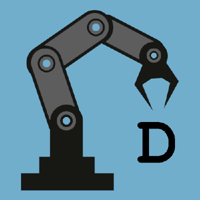

<!--
*** Thanks for checking out this README Template. If you have a suggestion that would
*** make this better, please fork the repo and create a pull request or simply open
*** an issue with the tag "enhancement".
*** Thanks again! Now go create something AMAZING! :D
***
***
***
*** To avoid retyping too much info. Do a search and replace for the following:
*** andreasgdp, Robot-hand-semester-2, AndreasGuldberg, andreasgdp@gmail.com
-->


<!-- PROJECT SHIELDS -->
<!--
*** I'm using markdown "reference style" links for readability.
*** Reference links are enclosed in brackets [ ] instead of parentheses ( ).
*** See the bottom of this document for the declaration of the reference variables
*** for contributors-url, forks-url, etc. This is an optional, concise syntax you may use.
*** https://www.markdownguide.org/basic-syntax/#reference-style-links
-->
[![Contributors][contributors-shield]][contributors-url]
[![Forks][forks-shield]][forks-url]
[![Stargazers][stars-shield]][stars-url]
[![Issues][issues-shield]][issues-url]
[![MIT License][license-shield]][license-url]
[![LinkedIn][linkedin-shield]][linkedin-url]


<!-- PROJECT LOGO -->
<br />
<p align="center">
  <a href="https://github.com/Andreasgdp/Robot-hand-semester-2">
    
  </a>

  <h3 align="center">Robot hand 2000</h3>

  <p align="center">
    A hand for to grap things.
    <br />
    <a href="https://github.com/Andreasgdp/Robot-hand-semester-2"><strong>Explore the docs »</strong></a>
    <br />
    <br />
    <a href="https://github.com/Andreasgdp/Robot-hand-semester-2">View Demo</a>
    ·
    <a href="https://github.com/Andreasgdp/Robot-hand-semester-2/issues">Report Bug</a>
    ·
    <a href="https://github.com/Andreasgdp/Robot-hand-semester-2/issues">Request Feature</a>
  </p>
</p>


<!-- TABLE OF CONTENTS -->
## Table of Contents

- [Table of Contents](#table-of-contents)
- [About The Project](#about-the-project)
  - [Built With](#built-with)
- [Getting Started](#getting-started)
  - [Prerequisites - Guide](#prerequisites---guide)
  - [Installation](#installation)
- [Programming workflow](#programming-workflow)
- [Usage](#usage)
    - [`Information coming soon...`](#information-coming-soon)
- [Roadmap](#roadmap)
- [Contributing](#contributing)
- [License](#license)
- [Contact](#contact)
- [Acknowledgements](#acknowledgements)


<!-- ABOUT THE PROJECT -->
## About The Project

[![Product Name Screen Shot][product-screenshot]]()


### Built With

* [C++]()
* [Pure manpower]()


<!-- GETTING STARTED -->
## Getting Started

To get a local copy up and running follow these simple steps.

### Prerequisites - Guide

Comming soon...

### Installation

6. Clone the repo
```sh
git clone https://github.com/andreasgdp/Robot-hand-semester-2.git
```
1. Install
```sh
Information comming soon...
```


<!-- USAGE EXAMPLES -->
## Programming workflow
This section will tell you how what the process of adding new features to the repo is like.

1. You will have to create an issue with the feature/bug that you want to work on. <a href="https://github.com/Andreasgdp/Robot-hand-semester-2/issues" target="_blank">Create issue here</a>
2. You will assign yourself to that issue and move the issue into the `In Progress` column in <a href="https://github.com/Andreasgdp/Robot-hand-semester-2/projects/2" target="_blank">Project Planning</a>
   1. A branch will be created with the issue number and name of the issue.
3. You are to work on your feature on that specific branch and **NOT on the `master branch`**
4. When done with your feature, you will have to create a Pull Request (PR). You can do that <a href="https://github.com/Andreasgdp/Robot-hand-semester-2/compare" target="_blank">here</a>
   1. After creating a pull request you can assign another person to review your code and then accept it.
5. When your code has been accepted you will be able to merge your feature into the `master branch`.****


<!-- USAGE EXAMPLES -->
## Usage
#### `Information coming soon...`


<!-- ROADMAP -->
## Roadmap

See the [open issues](https://github.com/andreasgdp/Robot-hand-semester-2/issues) for a list of proposed features (and known issues).


<!-- CONTRIBUTING -->
## Contributing

Contributions are what make the open source community such an amazing place to be learn, inspire, and create. Any contributions you make are **greatly appreciated**.

1. Fork the Project
2. Create your Feature Branch (`git checkout -b feature/AmazingFeature`)
3. Commit your Changes (`git commit -m 'Add some AmazingFeature'`)
4. Push to the Branch (`git push origin feature/AmazingFeature`)
5. Open a Pull Request


<!-- LICENSE -->
## License

Distributed under the MIT License. See `LICENSE` for more information.


<!-- CONTACT -->
## Contact

Your Name - [@AndreasGuldberg](https://twitter.com/AndreasGuldberg) - andreasgdp@gmail.com

Project Link: [https://github.com/andreasgdp/Robot-hand-semester-2](https://github.com/andreasgdp/Robot-hand-semester-2)


<!-- ACKNOWLEDGEMENTS -->
## Acknowledgements

* []()
* []()
* []()


<!-- MARKDOWN LINKS & IMAGES -->
<!-- https://www.markdownguide.org/basic-syntax/#reference-style-links -->
[contributors-shield]: https://img.shields.io/github/contributors/andreasgdp/Robot-hand-semester-2.svg?style=flat-square
[contributors-url]: https://github.com/andreasgdp/Robot-hand-semester-2/graphs/contributors
[forks-shield]: https://img.shields.io/github/forks/andreasgdp/Robot-hand-semester-2.svg?style=flat-square
[forks-url]: https://github.com/andreasgdp/Robot-hand-semester-2/network/members
[stars-shield]: https://img.shields.io/github/stars/andreasgdp/Robot-hand-semester-2.svg?style=flat-square
[stars-url]: https://github.com/andreasgdp/Robot-hand-semester-2/stargazers
[issues-shield]: https://img.shields.io/github/issues/andreasgdp/Robot-hand-semester-2.svg?style=flat-square
[issues-url]: https://github.com/andreasgdp/Robot-hand-semester-2/issues
[license-shield]: https://img.shields.io/github/license/andreasgdp/Robot-hand-semester-2.svg?style=flat-square
[license-url]: https://github.com/andreasgdp/Robot-hand-semester-2/blob/master/LICENSE.txt
[linkedin-shield]: https://img.shields.io/badge/-LinkedIn-black.svg?style=flat-square&logo=linkedin&colorB=555
[linkedin-url]: https://www.linkedin.com/in/andreas-g-d-petersen-11707518b/
[product-screenshot]: images_readme/robot_arm.jpg
